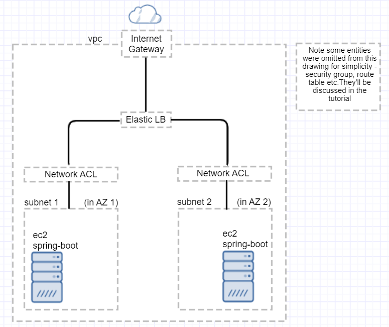

# Spring Boot Demo: AWS deployment!

## Overview
This is a simple Spring Boot Demo.
Its main purpose is to to demonstrate deployment to AWS!

The app's endpoints are pretty simple, but some of them use network or file resources, which
may fail depending on setup.

 mvnw spring-boot:run
* Point browser at http://localhost:8080/greet

* Packaging: >mvnw clean package spring-boot:repackage
* Running from jar: >java -jar bootHi.jar --server.port=8081 someOtherArgs

