# Spring Boot Demo: AWS deployment!
## By Pelit Mamani

## Overview
This is a simple Spring Boot Demo.
Its main purpose is to to demonstrate deployment to AWS!

The app's endpoints are pretty simple, but some of them use network or file resources, which
might fail depending on setup.

<br/>

|Spring Boot App|AWS Deployment|
|---------------|--------------|
|&nbsp;&nbsp;&nbsp;|&nbsp;&nbsp;&nbsp;|

<br/>

## Testing the Spring Boot app locally
First try the app locally:
Pull the code, and view the application.properties - there you can change ports if needed:
```
spring-aws-demo/src/main/resources/application.properties
spring-aws-demo/src/main/resources/application-test.properties
```
Open the command prompt in the project root (/spring-aws-demo/)
And package the app into a jar:
``` 
> mvnw clean package spring-boot:repackage
```
Running: 
```
Using maven:
> mvnw spring-boot:run

Or jar execution:
> java -jar target/spring-aws-demo-0.0.1.jar

You can also control some arguments, e.g.:
> java -jar target/spring-aws-demo-0.0.1.jar --server.port=8081 --GREET_ENDING="Have a good one!"
```
Now point the browser at the app (assuming you chose port 8080):
```
http://localhost:8080/greet-app
```

 
Feel free to press the items - 'Greet' is the simplest and rarely fails.
Other actions would access resources such as files or network, and might fail if access is restricted (that's the whole point! E.g. if we later deploy into an AWS network that limits outbound http connections, than the corresponding action will fail).
<br/>
<br/>

## AWS Prerequisites & Disclaimer

* If you don't have an AWS account yet, you might consider [AWS trial free tier](https://aws.amazon.com/free/).
* If you're new to AWS, please be careful with billing - don't leave unused instances running overnight! 
* Please double-check before using anything, is it eligible for the free layer (even resources mentioned in this tutorial, as policies might change). You might also consider setting up billing alarms. 
* This demo aims for simplicity - it's not production-ready,  and not very secure.

<br/>

## Deploying to a single ec2 instance
Let's start with this simple, single-instance configuration: 

<br/><br/>

<br/><br/>

Let's get started! Log into the AWS console, and choose a **region**.
Amazon has several geographical regions, that are separate from each other (some of them are even in different continents). Our entire configuration will reside in on region, say, Oregon. <br/>
In production, please chose the region carefully - is it close to your users, for better latency? Does you business need to meet any legal requirements about server location?
<br/><br/>

<br/>
<br/>
Now, let's create a **vpc with IP range 10.0.0.0/16** and a **subnet with the sub-range 10.0.1/24**. <br/>
The vpc will be our network, residing in one region. A vpc can have several subnets, that can reside in different availability zones (building). For simplicity we'll start with a single subnet in a single AZ, but it won't be the best protection against natural disasters.<br/>
<br/>

For the vpc, chose Services->VPC->Your VPCs->Create VPC, then: <br/>
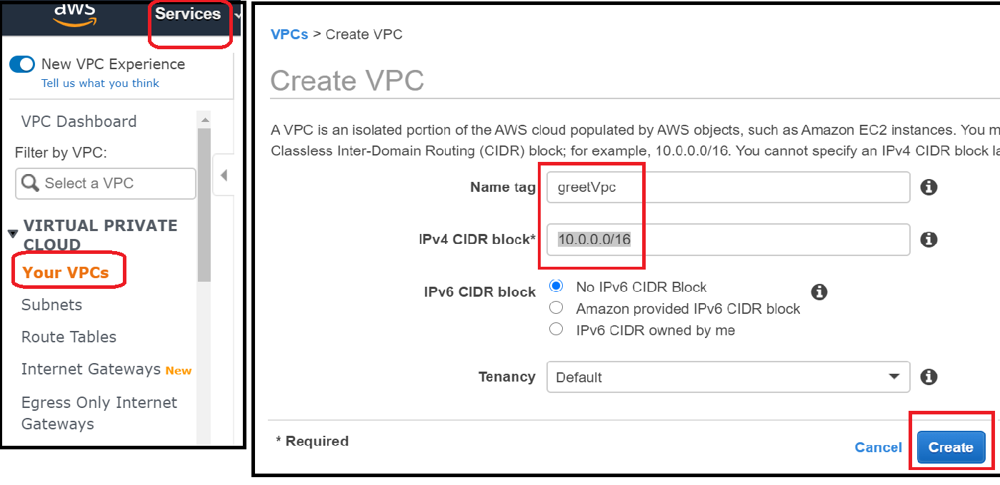<br/>
<br/>
For the subnet, chose Subnets-> Create subnet.<br/>
Coose our vpc, our requires IP sub-range, and availability zone (which can either be chosen by you, or by aws). <br/>
We'll call it "greetPublicSubnet" because we plan to connect it to the outside world (if we had more resources, that are only accessed internally from our Spring Boot application, e.g. a database - we could make a second, private subnet. But we don't need that here):<br/>
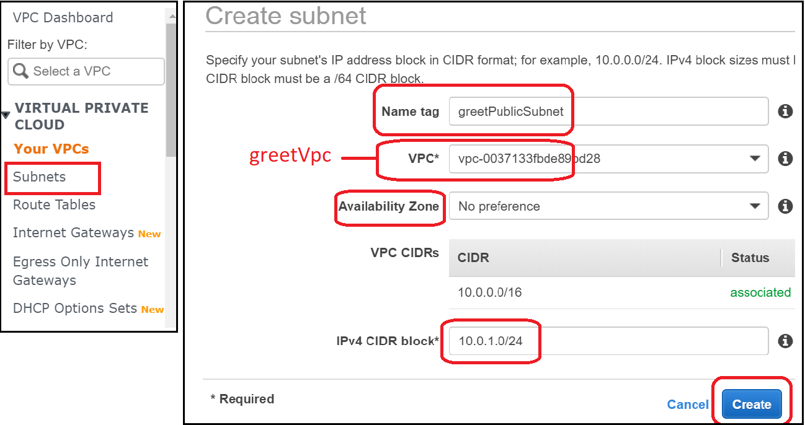<br/>
<br/>

We'll also need an internet gateway, to allow communication with the outside world.<br/>
Select Internet Gateways -> Create Internet Gateway. <br/>
After it's created, attach it to our vpc:<br/>

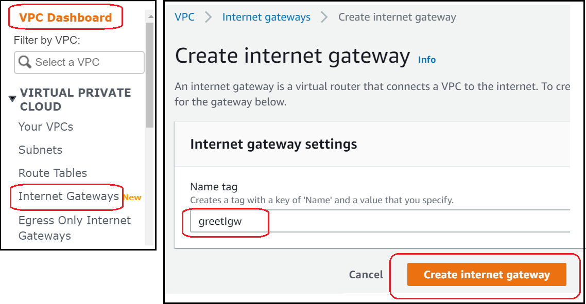<br/>
<br/>
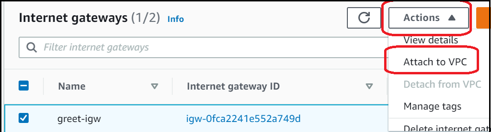<br/>
<br/>

Next, we need to edit our subnet's **Route Table.**<br/>
Originally it only allows internal communication; we'll add routing to the internet gateway, so that our subnet becomes exposed to the world.<br/>
So, navigate to the subnet's Route Table, and there add a route to the internet gateway:
 
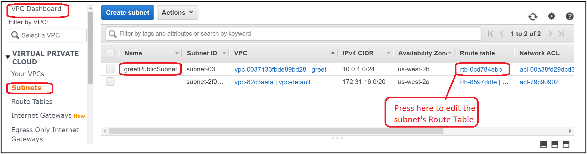<br/>
<br/>
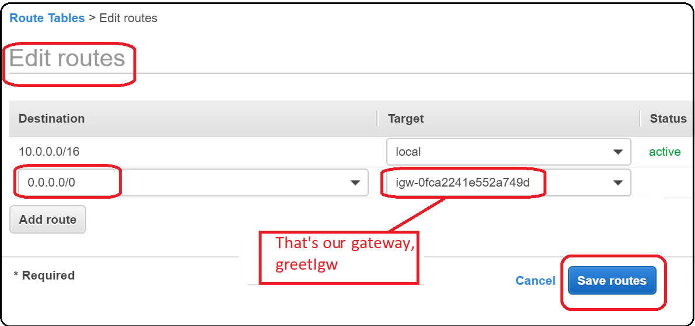<br/>
<br/>

Also check our subnet's NACL - its security rules. For this demo we'll leave the default that allows all communication, both inbound and outbound. In production, consider finer rules, e.g. "only http, https, and also ssh from my machine only". <br/>
To summarize, our network has both a "router" (Route Table) that directs its communication, and a "firewall" (NACL) to fine-tune what specific protocols/destinations are allowed. 

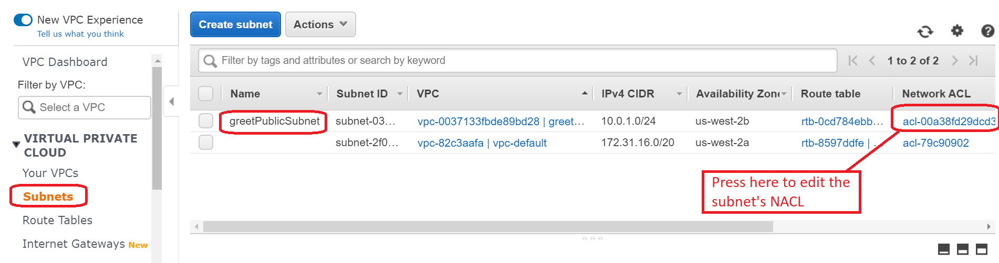<br/>
<br/>
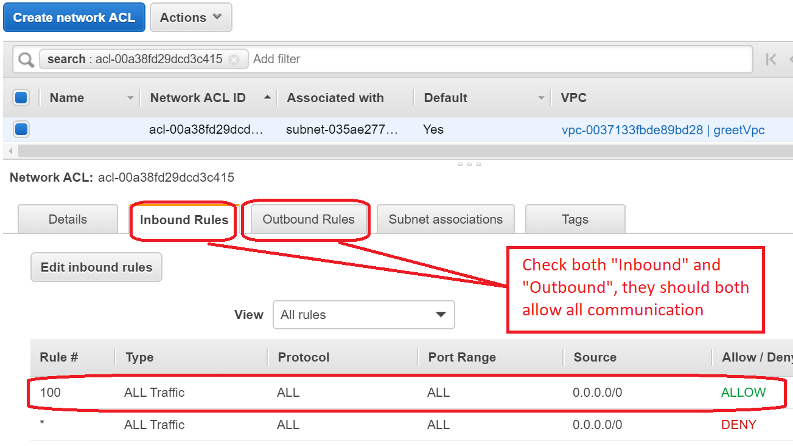<br/>
<br/>

The last network-related configuration would be a security group - these are the finer-grained security rules for the instance level (namely for our server). <br/>
Let's create a security group "greetPublicSG", edit its inbound and outbound rules, and let them both allow "All Traffic" from/to "Anywhere":
<br/>
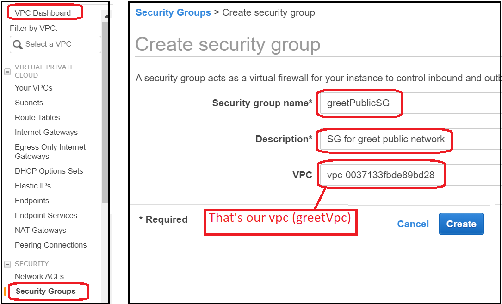<br/>
<br/>
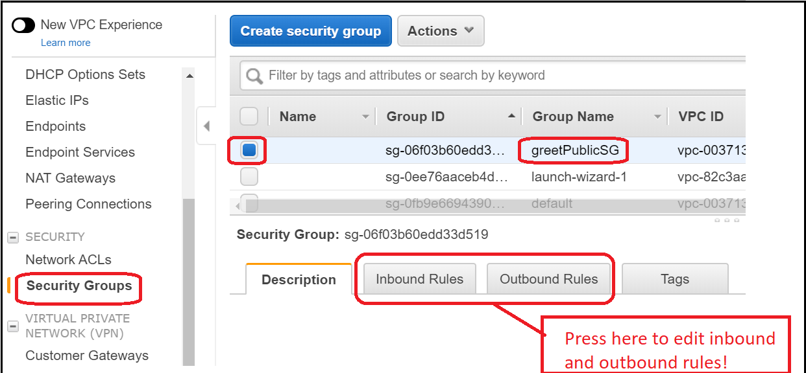<br/>
<br/>
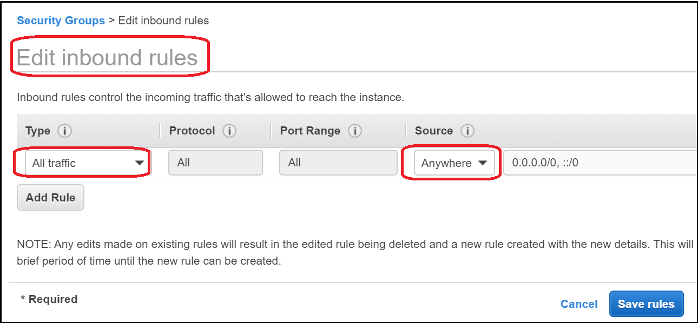<br/>
<br/>
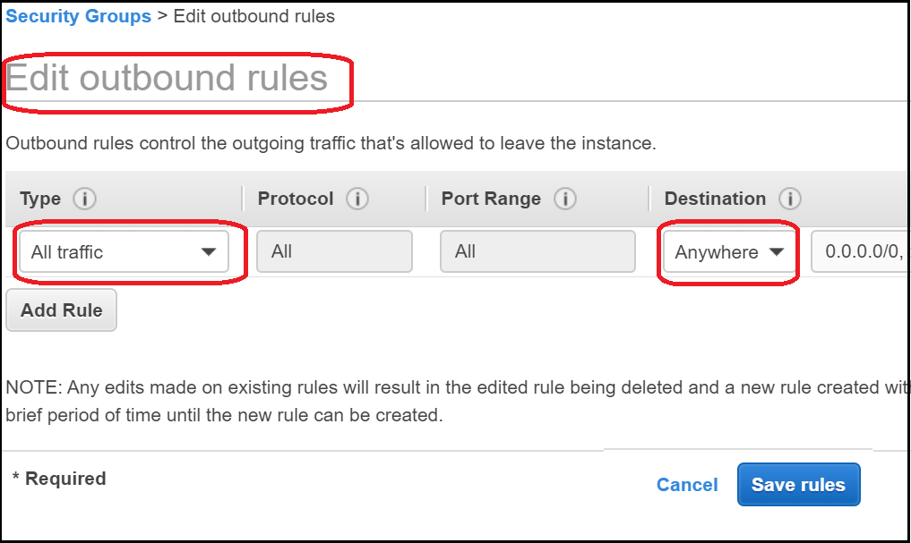<br/>
<br/>

And finally, to our much-anticipated ec2 instance! <br/>
Choose Services -> ec2 -> Instances -> Launch Instance <br/>
And select the machine image for Amazon Linux 64bit, that is free-tier eligible:<br/>
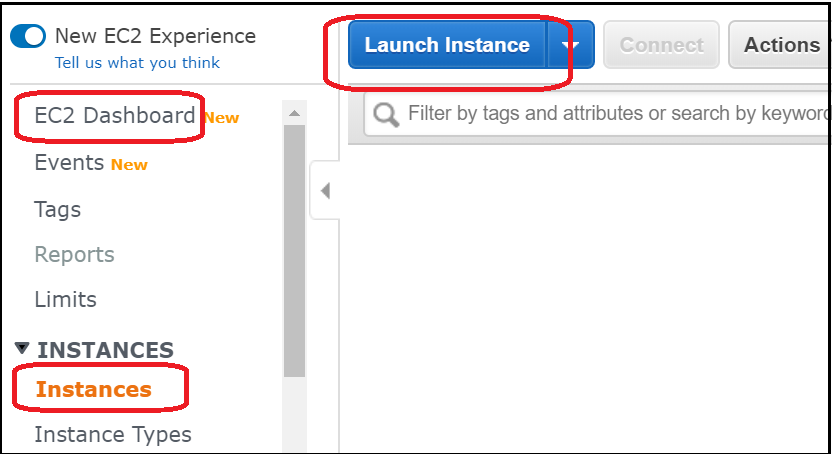<br/>
<br/>
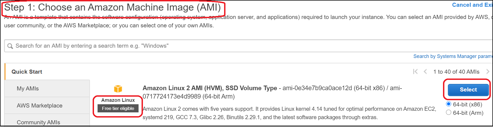<br/>
<br/>
Next, we're asked to chose the instance type - to determine how much RAM, CUP etc our machine will have. Feel free to browse the impressive variety of types optimised for different purposes and different budgets, but we'll start with t2.micro, that is free-tier eligible:
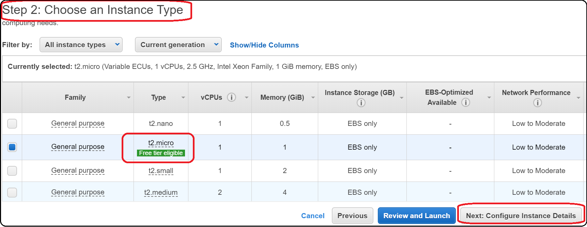<br/>
<br/>
Next, associate our instance with our subnet, and make sure it gets a public IP.<br/>
Careful of typos, because some of them are hard to edit later): <br/>
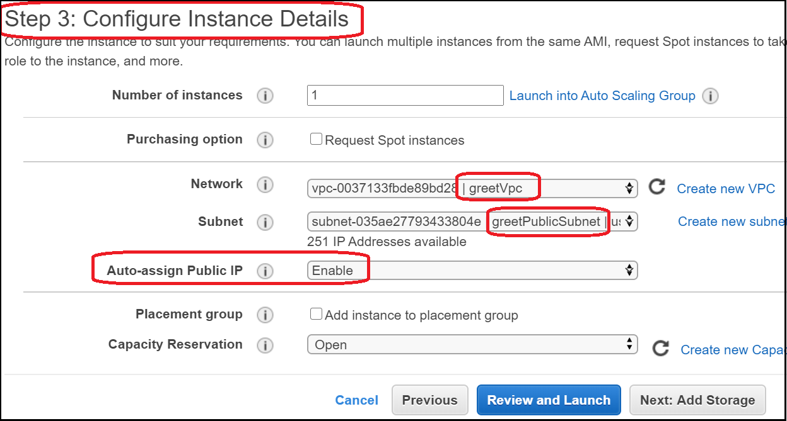<br/>
<br/>
This same page has an "advanced" section, which allows us to add a script that your server will execute on startup. Let's update yum, and install java11: <br/>
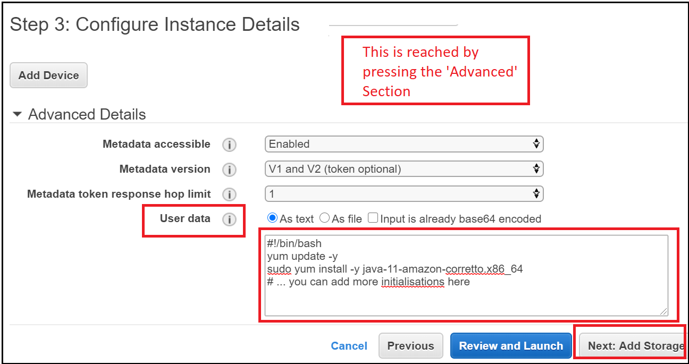<br/>
<br/>
Next comes storage configuration - our server's "hard drive".<br/>
**One big "Gotcha" is the "delete on termination" checkbox!** This means our data will be lost when the ec2 instance is terminated. It's fine here, since our web server shouldn't write any critical data locally (business data should go to a database, and logs are better configured to stream to AWS Logs, though it won't be covered here). Remember that in an elastic environment, web server instances might be taken up and down depending on loads, they might be crashed and replaced, so they better not hold critical data. But if your ec2 is used for storage (e.g. setting up your own database, rather than Amazon's ready-made ones) then please avoid "deleting on termination".<br/>
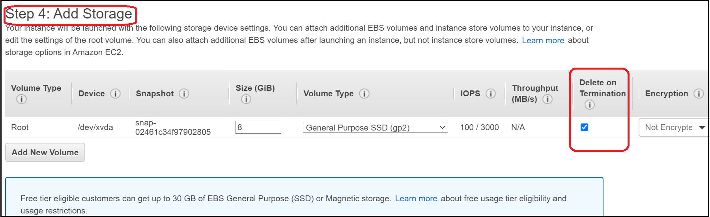<br/>
<br/>
Next is the security group - associate our server with our greetPublicSG that allows all communication:<br/>
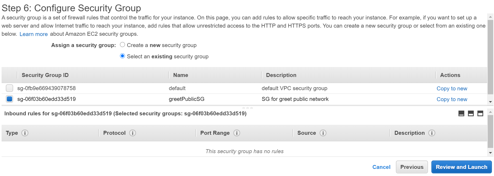<br/>
<br/>
Finally, we can launch the instance! <br/>
On lanuch, you will get a .pem file (key pair) - keep it safely, and we'll later use it with Putty.
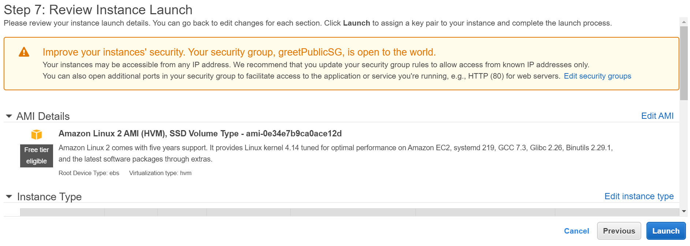<br/>
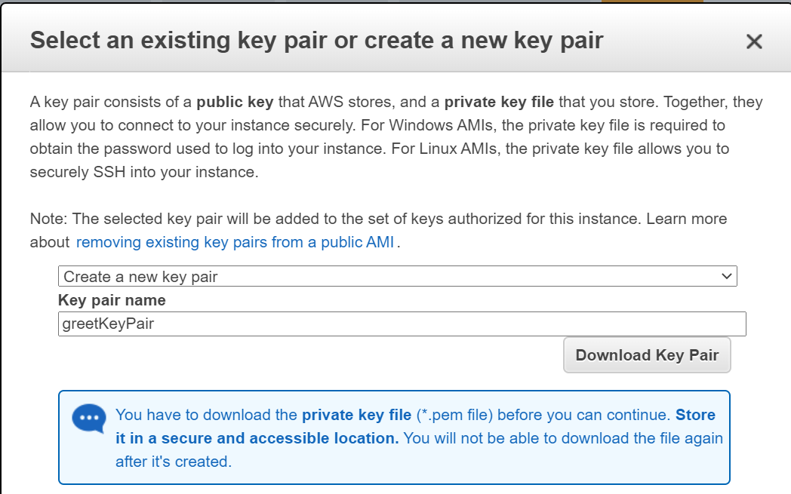<br/>

Now our server is ready with a linux OS, and even java (that we downloaded on the "User Data" step above). We just need to upload & run our jar! There are a few ways to do that: 

SORRY - THIS SECTION IS UNDER CONSTRUCTION, WILL BE UPDATED SOON
<br/>
<br/>
<br/>
<br/>

EEffects on our app:<br/><br/>
Greet: Our Spring Boot app will only respond if the subnet is properly configured for external http communication! Feel free to see how it stops responding if you misconfigure the gateway, route table, NACL or security group. <br/><br/>
Disk I/O: Our ec2 is provided with storage, so this should work (unless you generate lots of huge files). But how long will your file be available? This depends on the storage attachment policy - if the storage is "attached" to the ec2, and the ec2 is terminated, you'd lose your data. That's a big 'Gotcha' that is better discovered in this test, and not in production...<br/><br/>
Environment variables: Feel free to set them up, and watch the effect. <br/><br/>
No Scaling Yet: If we overload the CPU, well, tough luck - all other requests will slow down. This can be solved by horizontal scaling - namely more ec2 instances. Better still, if we ask AWS to automatically add/remove ec2's depending on the load - that's elasticity! <br/><br/>
<br/>


## Under construction - Coming up Soon
*	Uploading the spring app jar - using WinSCP or downloading
*	Automatic config using CloudFormation 
*	Auto scaling. We'll set up auto scaling, overload the cpu, and see if new instances will be automatically launched
*	Load balancer (ALB)
*	(Just please remember to stop instances and other resources!!)

