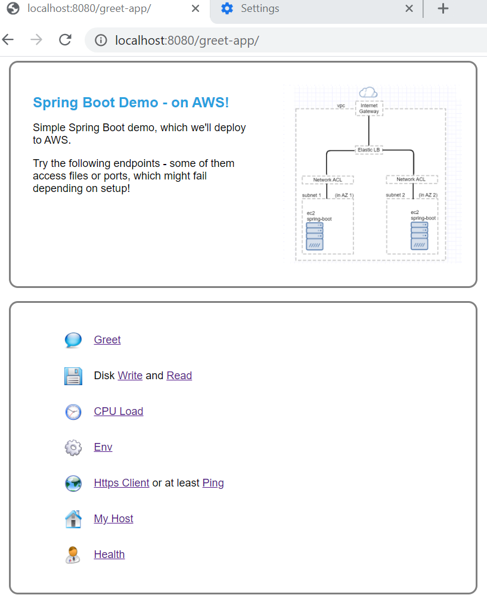
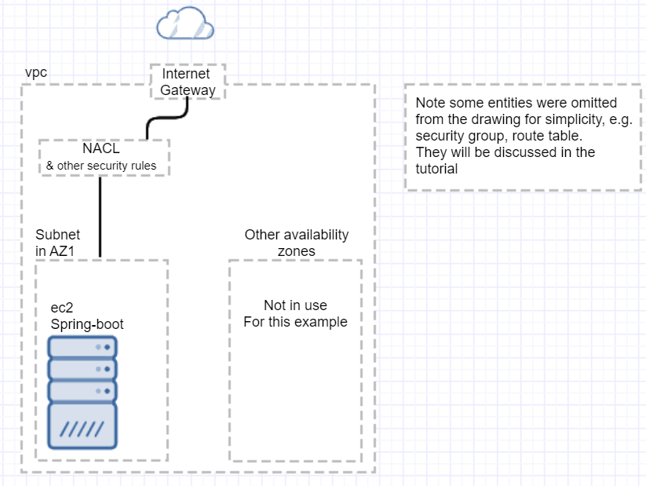

# Spring Boot Demo: AWS deployment!
## By Pelit Mamani

## Overview
This is a simple Spring Boot Demo.
Its main purpose is to to demonstrate deployment to AWS!

The app's endpoints are pretty simple, but some of them use network or file resources, which
might fail depending on setup.

<br/>

|Spring Boot App|AWS Deployment|
|---------------|--------------|
|&nbsp;&nbsp;&nbsp;|&nbsp;&nbsp;&nbsp;|

<br/>

## Testing the Spring Boot app locally
First try the app locally:
Pull the code, and view the application.properties - there you can change ports if needed:
```
spring-aws-demo/src/main/resources/application.properties
spring-aws-demo/src/main/resources/application-test.properties
```
Open the command prompt in the project root (/spring-aws-demo/)
And package the app into a jar:
``` 
> mvnw clean package spring-boot:repackage
```
Running: 
```
Using maven:
> mvnw spring-boot:run

Or jar execution:
> java -jar target/spring-aws-demo-0.0.1.jar

You can also control some arguments, e.g.:
> java -jar target/spring-aws-demo-0.0.1.jar --server.port=8081 --GREET_ENDING="Have a good one!"
```
Now point the browser at the app (assuming you chose port 8080):
```
http://localhost:8080/greet-app
```

 
Feel free to press the items - 'Greet' is the simplest and rarely fails.
Other actions would access resources such as files or network, and might fail if access is restricted (that's the whole point! E.g. if we later deploy into an AWS network that limits outbound http connections, than the corresponding action will fail).
<br/>
<br/>

## AWS Deployments
Our purpose is to explore various deployment options, such as
*	Single instance, versus using a load balancer (ALB), versus auto scaling
*	Manual deployment
*	CloudFormation (under construction - coming soon)
*	Docker deployment (under construction - coming soon)

Prerequisites & Disclaimer:
* If you don't have an AWS account yet, you might consider [AWS trial free tier](https://aws.amazon.com/free/).
* However, if you are new to AWS, please be **very careful with billing**: consult the AWS documentation & support, double-check if items are eligible for the free tier (even items mentioned in this demo - there could be errors, oversights, or info might become outdated). 
* Please explore billing best practices such as: setting up **billing alerts**, terminating unused resources, **not leaving unnecessary instances running overnight** etc.
* Please note this demo makes **security compromises for the sake of simplicity.** This is not production-ready.

<br/>

## AWS Deployment - manual, single ec2 instance
Let's start with the simplest option: manual deployment through the AWS console,
using the simplest single-instance configuration.

** Our First Deployment:** <br/>
<br/>

<br/>

This will require:
1. An **ec2 instance**, representing the virtual server where our Spring Boot app will run. It will be provided with most items you'd expect on a computer: CPU, disk space, network, operating system etc. It's listed first, but we'll actually set it up last - after our network is ready.
1. A **vpc** (virtual private cloud): representing a virtual network that will be provided for us, spanning a range of IP addresses. It can contain several subnets in several availability zones.
1. A **subnet**: representing the internal network where our ec2 instance would run. A subnet uses a sub-range of IP addresses from the vpc. Each subnet resides in one physical location (availability zone) - so is not incredibly protected against natural disasters.
1. An **internet gateway**: geteway to the outside world - the internet. Once we connect this gateway to our subnet (with some routing & security configurations), our Spring Boot app will be able to serve browsers all over the world! 
1. **Routing & security rules** - in AWS entities such as: **Route Table, Network ACL, Security Group**.

** Let's get started:**
Log into the AWS console. For this demo we'll use the root user (the one we used for opening the account), though it's not very secure.
Locate the following two menu items: **region** and **services**. Chose a region and stick with it - if it accidentally changes, things might misbehave. **Services** is our link for various services, such as vpc, ec2 and much more.

 

## Under construction
Coming up soon
*	Setting up vcp, subnet, ec2 etc (single instance) with CloudFormation
*	Auto scaling. For this, we'll add a SpringBoot controller that intentionally overloads 
	the cpu, and watch it cause rescaling
*	 
