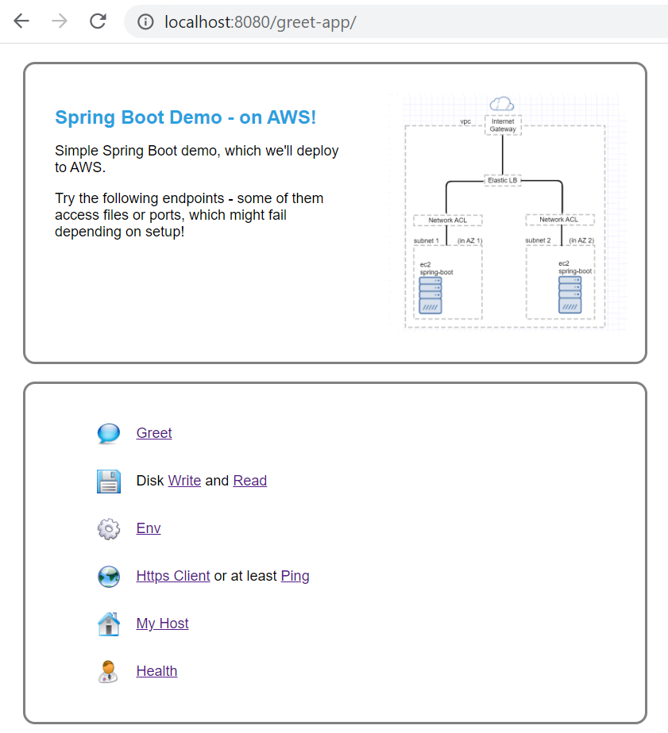

# Spring Boot Demo: AWS deployment!

## Overview
This is a simple Spring Boot Demo.
Its main purpose is to to demonstrate deployment to AWS!

The app's endpoints are pretty simple, but some of them use network or file resources, which
may fail depending on setup.

<br/>

|Spring Boot App|AWS Deployment|
|---------------|--------------|
|&nbsp;&nbsp;&nbsp;|&nbsp;&nbsp;&nbsp;|

<br/>

## Testing the Spring Boot app locally
First try the app locally:
Pull the code, and view the application.properties - there you can change ports if needed:
```
spring-aws-demo/src/main/resources/application.properties
spring-aws-demo/src/main/resources/application-test.properties
```
Open the command prompt in the project root (/spring-aws-demo/)
And package the app into a jar:
``` 
> mvnw clean package spring-boot:repackage
```
Running: 
```
Using maven:
> mvnw spring-boot:run

Proper execution through the jar:
>java -jar target/spring-aws-demo-0.0.1.jar

You can also control some arguments, e.g.:
>java -jar target/spring-aws-demo-0.0.1.jar --server.port=8081 --GREET_ENDING="Have a good one!"
```
View the results:
```
http://localhost:8080/greet
```


Feel free to press some of the items - 'Greet' is the simplest and likely to work.
Other actions would access resources such as files or network, and might fail if the access is restricted (that's the whole point! E.g. if we later deploy into an AWS network that limits outbound http connections, than the corresponding action will fail).

